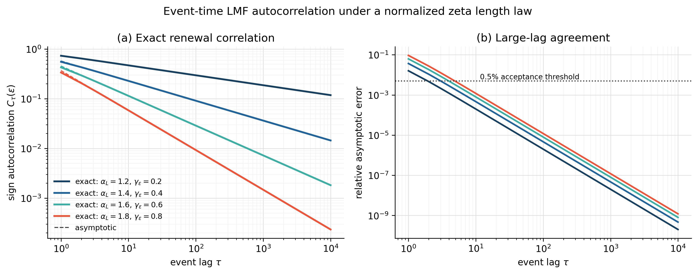
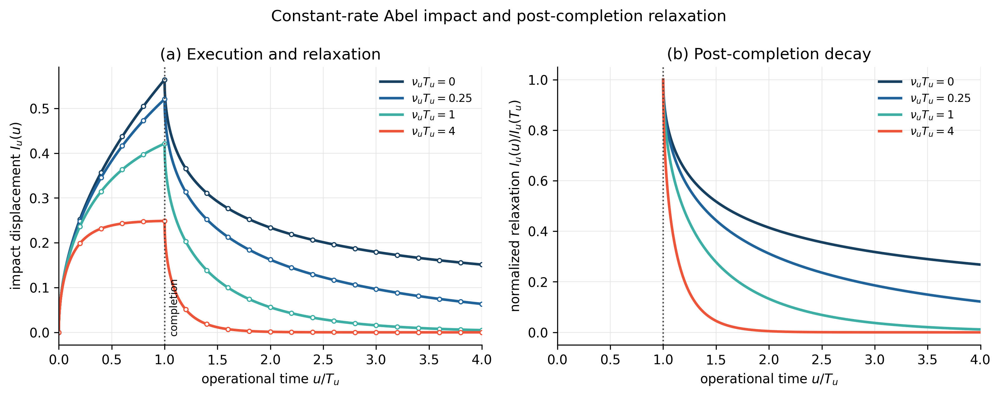

# Trade-sign long-memory and square-root impact reproducibility bundle

Version: v1.0.0

Supplementary computational material for:

> Chris Angstmann and Tim Gebbie, **“Revisiting Trade-sign Long-memory and Square-root Law price impact,”** [arXiv:2606.16269](https://arxiv.org/abs/2606.16269).

This repository is the reduced public reproducibility surface of the RD2LMF
(`RDL`) simulation project. It evaluates the paper's long-memory sign process,
subordination and clock conventions, reaction-boundary response, and
square-root-law completion scaling using controlled synthetic calculations.
It contains no empirical market data or calibration.

## Key scientific outputs

### Event-time long memory



**F03. Event-time LMF renewal correlation.** The exact renewal calculation
verifies the configured power-law decay and the relation
`gamma_epsilon = alpha_L - 1`. The public route also runs the seeded Monte Carlo
diagnostic used by the aggregate robustness gate.

### Reaction-boundary impact and relaxation



**F06. Reaction-boundary impact and relaxation.** Analytic and cell-integrated
Abel-response calculations verify the accepted operational-time response,
completion continuity, resilience limits and grid refinement.

## Release scope

The v1.0.0 bundle retains:

- F02 route-separated direct-event-counter and operational-response clock projections;
- F03 exact event-time LMF autocorrelation plus seeded Monte Carlo diagnostics;
- F05 finite-width single-child-order response;
- F06 reaction-boundary impact and post-completion relaxation;
- F07 completion-schedule and clock comparison, including the square-root and negative-control slopes;
- F08 conditional sign-convention TikZ schematic and its frozen rendered output;
- T01--T04 science/methods tables;
- W09 analytic, numerical, stochastic and invalid-input robustness checks;
- machine-readable figure data and retained stochastic raw outputs; and
- the frozen primary paper source, bibliography and theory-to-code provenance maps.

F02, F03 and F06 were explicitly operator accepted in the upstream development
workspace. F05 and F07 remain reproducible publication candidates, and F08 is
a conditional conceptual result. This repository preserves those scientific
dispositions rather than silently promoting them.

The release does **not** contain market data, empirical fitting, calibration,
optimisation, a trading strategy, a production execution simulator, or the
separately scoped full lattice/PDE latent-order-book model.

## Repository structure

```text
config/             Numerical parameter and robustness controls
functions/          Reusable analytical and numerical functions
scripts/            Single public runner and target scripts
data/               Generated figure/robustness CSV data
raw-outputs/        Retained seeded stochastic outputs
outputs/            Monte Carlo summary output
figures/            Python figures plus the F08 TikZ schematic
captions/           Figure and table captions
tables/csv/         Four reviewed table sources
tables/tex/         Four generated LaTeX table files
diagnostics/        Target and W09 diagnostic reports
registers/          Minimal acceptance register required by W09
provenance/         Theory-to-code and output-provenance maps
source/source-v0/   Frozen primary paper source and bibliography
```

The larger development workspace contained planning, review, checkpoint and
workflow-governance records. Those are intentionally excluded from this public
release because they are not runtime dependencies and do not improve scientific
reproduction.

## Installation

From a fresh clone:

```bash
python -m venv .venv
```

Activate the environment. On Windows PowerShell:

```powershell
.venv\Scripts\Activate.ps1
```

On macOS/Linux:

```bash
source .venv/bin/activate
```

Install the frozen package versions:

```bash
python -m pip install --upgrade pip
python -m pip install -r requirements.txt
```

The reference development runtime was CPython 3.12.13 with NumPy 2.3.5,
SciPy 1.17.0 and Matplotlib 3.10.8. `run_all.py` requires the three frozen
package versions and reports the active Python runtime explicitly.

## Reproducing the active outputs

Run:

```bash
python scripts/run_all.py
```

The expected final line is:

```text
Active v1.0.0 reproducibility route completed successfully.
```

The route regenerates F02, F03, F05, F06 and F07; F03 is run with `--with-mc`;
T01--T04 are restaged; W09 is rerun; and the reduced release surface is then
verified. F08 is a frozen conditional TikZ figure whose source and accepted
PDF/PNG hashes are checked rather than rebuilt by the Python route.

## Reproducibility interpretation

The numerical and scientific checks are the controlling reproducibility
criteria. Generated CSV and PNG outputs are deterministic under the frozen
package versions and seed contexts. The public runner also sets
`SOURCE_DATE_EPOCH=0`; in release-candidate testing, two consecutive complete
runs produced byte-identical regenerated Python PDFs as well as identical CSV,
PNG and diagnostic outputs. Cross-platform PDF byte identity is still not used
as a scientific acceptance criterion because renderer and font environments
can differ. F08 uses a separately controlled TikZ build and its retained
source/PDF/PNG hashes are verified exactly.

## Scientific boundary

The code verifies or illustrates theoretical objects under declared synthetic
parameters. The finite-mean and infinite-mean clock cases remain distinct, the
direct event-counter and operational-response routes are not composed, and
completion-schedule scaling is interpreted under its stated rate/horizon
conventions. Robustness sensitivities are retained as diagnostics rather than
being hidden by threshold changes.

## Citation and license

Suggested paper citation:

Angstmann, Chris; Gebbie, Tim (2026). *Revisiting Trade-sign Long-memory and
Square-root Law price impact*. arXiv:2606.16269.

| Item | Value |
|---|---|
| Associated paper | [arXiv:2606.16269](https://arxiv.org/abs/2606.16269) |
| Code license | MIT License |
| Generated figures, tables, captions, outputs and documentation | CC BY 4.0 |

See `CITATION.cff`, `LICENSE`, and `CONTENT-LICENSE.md`.
